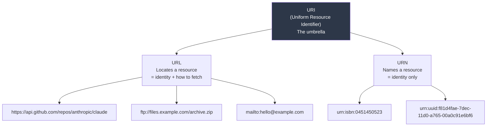

# URLs, URIs, and URNs

> Everyone uses these three letters wrong. Here's the actual hierarchy.

## The hook

URL and URI are not the same. They're not different either. Let's untangle this.

If you've ever read an RFC or the Java standard library and wondered why one method takes a `URI` and another takes a `URL`, this is the page. Most engineers use these terms like synonyms and get away with it for years — until they hit a spec where the distinction matters and the docs suddenly read like a foreign language.

After this page, you'll know which one is the umbrella, which one points at a thing, which one names a thing, and why anyone bothered to invent three acronyms for what looks like one idea.

## The concept

There's one umbrella term and two flavors underneath it.

- **URI — Uniform Resource *Identifier*.** The umbrella. Any string that uniquely identifies a resource is a URI.
- **URL — Uniform Resource *Locator*.** A URI that also tells you *where* the resource lives and *how* to get it.
- **URN — Uniform Resource *Name*.** A URI that names the resource without saying where it is.

The mental model: **every URL is a URI. Every URN is a URI. URLs and URNs are siblings, not synonyms.**

A URL is an address — `https://example.com/page`. You can fetch it.
A URN is a name — `urn:isbn:0451450523`. You can identify the book with it, but the string itself doesn't tell you where to go buy it.

In the real world, 99% of what you deal with is URLs. URNs show up in books, ISBNs, DOIs, and a few specs. But knowing the hierarchy keeps you from getting tripped up when a doc says "URI" and means "any of the above."

## Diagram



URL and URN both sit under URI. The examples on each side are the parts you actually see in code and on the web.

## Example — anatomy of a real URL

Take this URL apart:

```
https://api.github.com:443/repos/anthropic/claude?since=2025#commits
```

| Component | Value | What it is |
|---|---|---|
| Scheme | `https` | The protocol — how to talk to the resource |
| Authority | `api.github.com:443` | Where to find it (host + port) |
| Host | `api.github.com` | The server's domain name |
| Port | `443` | The TCP port (443 is HTTPS default; usually omitted) |
| Path | `/repos/anthropic/claude` | Which resource on that server |
| Query | `since=2025` | Parameters — filters, options, IDs |
| Fragment | `commits` | Client-side pointer — never sent to the server |

Every URL follows this shape: `scheme://authority/path?query#fragment`. Some pieces are optional (port, query, fragment), some are required (scheme, host for most schemes).

Now contrast with a URN:

```
urn:isbn:0451450523
```

- `urn` — the scheme, locked to the literal string `urn`
- `isbn` — the namespace identifier (NID), telling you what kind of name this is
- `0451450523` — the namespace-specific string (NSS), the actual ID inside that namespace

A URN points at an identity that's stable forever — the ISBN of *Stranger in a Strange Land* will never change, even if Amazon goes out of business. A URL can break the moment a server moves. That's the trade-off the two formats were designed for.

## Mechanics: URL components

| Part | Required? | Example | What it does | When it matters |
|---|---|---|---|---|
| **Scheme** | Yes | `https`, `ftp`, `mailto` | Picks the protocol — defines how to interpret everything after | API design (custom schemes for deep links), security (no `http://` for sensitive endpoints) |
| **Authority** | Usually | `api.github.com:443` | Host + optional port + optional userinfo | DNS lookups happen here; ports matter for non-default protocols |
| **Path** | Yes | `/repos/anthropic/claude` | Hierarchical pointer to the resource on the server | REST API design — `/users/42/posts` is the contract |
| **Query** | No | `?since=2025&limit=10` | Key-value parameters as `key=value&key=value` | Filters, pagination, search, tracking parameters |
| **Fragment** | No | `#commits` | Client-side anchor — browser scrolls/highlights, server never sees it | SPAs (`#/route`), deep links into a long page |
| **Userinfo** | No | `user:pass@` (before host) | Inline credentials — almost always avoid | Showing up here in 2026 means the URL is broken; use auth headers instead |

A few rules worth knowing:

- **Percent-encoding** is how special characters get into URLs. A space becomes `%20`, a `?` in a query value becomes `%3F`. If you're hand-building URLs, encode user input — never concatenate.
- **The query string isn't a standard format.** `?key=value&key=value` is a *convention* (form-urlencoded), not part of the URL spec itself. Some APIs use comma-separated values or repeated keys. Check the docs.
- **Fragments stay client-side.** If your "auth token" is in the fragment of a redirect URL, it never reaches your server logs. OAuth implicit flow used to rely on this; modern flows don't.

## Related concepts

| Concept | What it is | How it relates |
|---|---|---|
| **DNS** | Resolves the host portion of a URL to an IP address | The authority section of every URL eventually goes through DNS |
| **HTTP / HTTPS** | The protocols most URLs use | The scheme tells the client which one to speak |
| **Percent-encoding** | Escaping special characters as `%XX` | The reason `space` becomes `%20` in URLs — required for non-ASCII or reserved chars |
| **Query string** | The `?key=value&...` portion | A convention layered on top of the URL spec; libraries parse it for you |
| **URN namespace** | Registered prefix like `isbn`, `uuid`, `nbn` | What gives a URN meaning — without a registered NID, the name is just a string |
| **IRI** | Internationalized Resource Identifier — URIs with full Unicode | A URI's superset that allows characters beyond ASCII; browsers convert IRIs to URIs under the hood |

## When you need to know the difference

For 99% of day-to-day work, "URL" is fine. Browsers say URL. Your devs say URL. Nobody's correcting anyone in standup.

The distinction starts mattering when:

- **Reading specs (RFCs, W3C, IETF docs).** When a spec says "URI," it means *any* identifier — including URNs and abstract identifiers. If you read it as "URL," you'll misunderstand which inputs are valid.
- **Designing REST APIs.** REST uses "URI" deliberately — a resource has an identifier, which *might* also be a URL you can GET. The Roy Fielding dissertation that defined REST is precise about this.
- **Working with library APIs that use both types.** Java's `java.net.URI` vs `java.net.URL` is the canonical example — `URL` opens connections, `URI` just parses and validates. Pick the wrong one and you get unexpected DNS lookups in your unit tests.
- **Building anything with stable identifiers.** If you need an ID that survives the resource moving (database keys, document IDs, content addressing), you want URN-style thinking, not URL-style.
- **OAuth, OpenID, and federation specs.** These specs use "URI" precisely. Misreading it leads to subtle bugs in redirect validation.

If none of the above is on your plate this quarter, "URL" is fine. File the distinction away for when it isn't.

## Key takeaway

- **URI is the umbrella. URL and URN are subtypes.** Every URL is a URI; not every URI is a URL.
- **URL = locator.** It tells you where something is and how to get it.
- **URN = name.** It identifies something forever, but doesn't say where to find it.
- **URLs decompose into seven parts** — scheme, authority, host, port, path, query, fragment. Knowing them is the difference between guessing and debugging.
- **In casual use, "URL" is fine.** In specs, library APIs, and REST design, the precise word matters.

---

*Quiz available in the SLAM OG app — three questions on the URI/URL relationship, URL anatomy, and when the distinction actually matters.*
