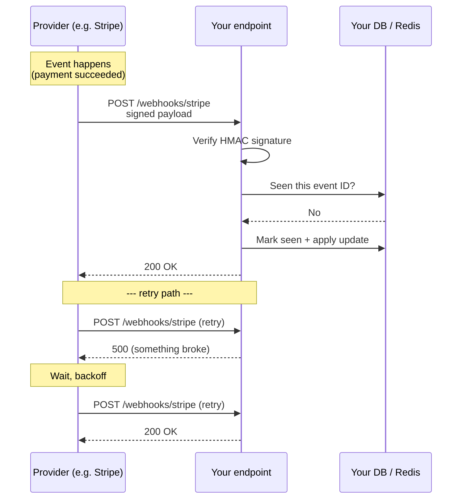

# Webhooks vs Polling

> Stop asking. Get called back.

## The hook

Polling is wasteful. You hit `/events` every 5 seconds, and 90% of the time the answer is "nothing changed." You're paying for the request, the server is paying for the response, and the user is still waiting because your next poll isn't for another 4 seconds.

Webhooks invert the pattern. Instead of you asking, the server calls *you* the moment something happens. One HTTP POST, near-instant, no wasted requests.

Polling is asking "anything yet?" over and over. Webhooks are the server tapping you on the shoulder when there is.

## The concept

A webhook is an HTTP POST the server sends to a URL you registered, when an event happens. You expose an endpoint like `POST /webhooks/stripe`, hand the URL to the provider, and the provider calls it on every event.

Three things make webhooks production-grade:

1. **Signing** — the server includes an HMAC signature in a header. You verify it against your shared secret before trusting the payload. Without this, anyone who learns your URL can POST fake events.
2. **Retry** — if your endpoint returns a non-2xx status (or doesn't respond), the server retries with exponential backoff. Stripe retries for up to 3 days. GitHub for about 5 hours.
3. **Idempotency** — the same event might arrive twice (retries, glitches, the network being the network). Your handler has to be safe to run multiple times without doing the work twice.

Get any of those wrong and you'll regret it. Skipped signing means a stranger can fake a payment event. No retries means a single 500 loses the data. No idempotency means you charge the user twice or fire two confirmation emails.

## Diagram



The retry loop is what makes the system reliable end-to-end. The provider keeps trying until you ack.

## Example — Stripe webhooks, the deep version

A customer completes a payment on your site. Here's what actually happens.

Stripe POSTs to your registered URL with a payload like:

```json
{
  "id": "evt_<EXAMPLE_EVENT_ID>",
  "type": "payment_intent.succeeded",
  "data": { "object": { "amount": 2000, "currency": "usd", "...": "..." } }
}
```

The request includes a signature header:

```
Stripe-Signature: t=1234567890,v1=<HMAC>
```

Your handler does five things, in this order:

1. **Read the raw body.** Don't parse JSON first. The HMAC is computed over the raw bytes, and most JSON libraries will reformat whitespace or key order on re-serialization. Read bytes, verify, *then* parse.
2. **Verify the HMAC** against your webhook secret (`whsec_<YOUR_WEBHOOK_SECRET>`). Compute `HMAC-SHA256(secret, timestamp + "." + raw_body)` and compare it against the `v1` value in the header using a constant-time comparison. If it doesn't match, return 400 and stop.
3. **Dedupe.** Check the event ID against a "seen" set in Redis (`SETNX webhook:seen:evt_<id> 1 EX 86400`). If it was already there, skip the work and return 200 anyway.
4. **Update your DB.** Mark the order paid, fire the receipt job, whatever the event implies. Keep this fast — or push it to a queue and let a worker handle it.
5. **Return 200.** Quickly. Under a few seconds.

If you return 500, Stripe retries with exponential backoff for up to **3 days**. If those retries also fail, the event lands in Stripe's "failed webhooks" dashboard, and you get an email. You can replay them manually from there — but if you're replaying webhooks by hand at any volume, the system is broken.

## Mechanics — what to actually handle

| Concern | What it means | How to handle it |
|---|---|---|
| **Signature verification** | Confirms the request came from the provider, not a stranger | Always verify. Constant-time compare. Use the raw body, not the parsed object. |
| **Retries** | Provider re-sends on non-2xx or timeout | You don't control the schedule (Stripe: 3 days, GitHub: ~5 hours). You handle the duplicates. |
| **Idempotency** | Same event might arrive multiple times | Store event IDs in Redis or a `webhook_events` table. If seen, skip. Still return 200. |
| **Timeouts** | Providers usually expect a response in 10–30 seconds | Ack fast. Push heavy work to a job queue. Don't do DB writes, emails, and third-party calls inline. |
| **Dead-letter handling** | Events that exhausted all retries | Track them. Alert when count > 0 for too long. Build a replay tool — don't fix them by hand. |
| **Out-of-order delivery** | Event B might arrive before event A | Use timestamps or a state machine — don't assume order. |

The pattern: ack fast, dedupe always, work async. Inline processing is what kills webhook systems under load.

## Related concepts

| Concept | What it is | How it relates to webhooks |
|---|---|---|
| **Polling** | Client repeatedly asks the server "any updates?" | The thing webhooks replace. Use polling when you don't control consumers or events are too frequent for one-POST-per-event. |
| **Message Queue** | Async durable channel for messages between services | Same shape, internal use. Webhook handlers usually drop work onto a queue so the HTTP path stays fast. |
| **Server-Sent Events (SSE)** | Long-lived HTTP connection that streams events to the client | Alternative when the consumer can hold a connection open and doesn't have a public URL. |
| **Idempotency** | Operation safe to run multiple times | Mandatory for webhook handlers. Dedup by event ID. |
| **HMAC Signing** | Symmetric signature over a payload using a shared secret | The standard auth mechanism for incoming webhooks. Stripe, GitHub, Slack all use it. |
| **Retry / Exponential Backoff** | Re-attempt failed requests with increasing delays | What the provider does when you return non-2xx. You inherit the duplicates. |
| **Dead-Letter Queue** | Holding area for events that exhausted retries | Where failed webhooks go to be inspected and replayed. |
| **API Gateway** | Entry point that adds auth, rate limiting, and routing | Often where webhook signature verification and rate limits live in front of your service. |

Webhooks pull together a half-dozen patterns at once. That's why they look simple and feel hard.

## When (and when not) to use it

**Use webhooks when:**

- **Events happen unpredictably and consumers want them quickly** — payment completed, code pushed, file upload finished, build done. Polling for these is either too slow or too wasteful.
- **You control (or trust) the consumer side** — they have a public URL, they can verify signatures, they can dedupe.
- **Volume is moderate** — one POST per event is fine when events are sparse.

**Skip webhooks when:**

- **You don't control consumers** — most end users don't have a public URL you can POST to. Build a polling API or SSE instead.
- **Consumer reliability is weak** — if the receiver drops events, you're inventing a distributed system. Use a real message queue (SQS, Kafka) and let the consumer pull at its own pace.
- **Events are extremely frequent** — one HTTP request per event is wasteful at high rates. Batch them, or stream over a persistent connection.
- **The receiver needs guaranteed ordering** — webhooks make no order guarantees across retries. Use a queue with sequencing.

The default for "external system needs to notify our system about something that happened" is webhooks. Past that, the questions get interesting.

## Key takeaway

- **Verify signatures.** The URL alone isn't auth — anyone who finds it can POST fake events.
- **Dedupe by event ID.** Duplicates *will* happen. Idempotency is the cost of admission.
- **Return 200 fast.** Under a few seconds. Providers will time out and retry slow handlers.
- **Queue heavy work.** The webhook handler's only job is "verify, dedupe, ack." DB writes, emails, third-party calls go to a worker.
- **Track your dead-letter pile.** If failed webhooks are growing, something upstream is broken — and you only know if you're watching.

---

*Quiz available in the SLAM OG app — three questions on signature verification, idempotency, and why slow handlers get retried into the ground.*
